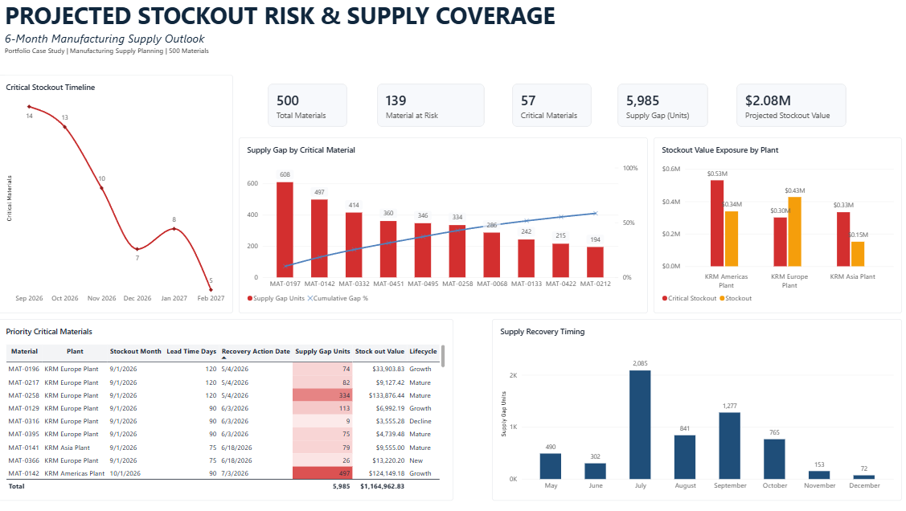

# Projected Stockout Risk & Supply Coverage

**Supply Planning Analytics Portfolio Project | Databricks SQL | Python | Power BI**

A 6-month manufacturing supply planning analysis designed to identify projected stockout risks, quantify supply gaps and financial exposure, and prioritize materials requiring recovery action.

---

## Dashboard

---

## Business Problem

A portion of the 500-material portfolio is projected to experience stockouts within the next six months, creating supply shortages and financial exposure.
The objective is to convert supply and demand data into a prioritized exception list that supports proactive supply planning decisions.

---

## Objective

Identify and prioritize critical materials based on shortage magnitude, timing, location, and financial exposure to support targeted supply recovery actions.

---

## Dataset

This project uses a synthetic manufacturing supply planning dataset representing **500 materials across multiple plants**.

The dataset was generated with **ChatGPT assistance** and structured specifically for this portfolio case study to simulate a manufacturing planning environment. It contains no confidential or proprietary company data.

The analysis combines:

- Material master data
- Customer master data
- Historical demand actuals
- Demand forecast
- Inventory snapshots
- Planned supply
- Material lead times
- Plant and lifecycle attributes

---

## Methodology

### Databricks SQL — Data Preparation & Validation

Databricks SQL was used to validate, prepare, and integrate the planning datasets before stockout-risk analysis, including:

- Record count and uniqueness checks
- Duplicate and missing-value validation
- Master-data consistency checks
- Demand, inventory, and planned-supply validation
- Integration of planning datasets
- Projected stockout and supply-gap calculations

### Databricks Python — Stockout Risk Analysis

Python within Databricks was used to analyze the prepared stockout-risk dataset using Spark DataFrames and evaluate:

- Material-level stockout exposure
- Critical-material prioritization
- Supply-gap concentration
- Plant-level exposure
- Stockout timing
- Recovery-action timing based on material lead time

### Power BI — Decision Support & Visualization

Power BI was used to translate the analytical output into an operational supply-planning dashboard focused on:

- Stockout-risk KPIs
- Critical-material prioritization
- Supply-gap Pareto analysis
- Plant-level financial exposure
- Stockout timing
- Recovery-action timing

---

## Key Findings

- **500 materials** were evaluated across the planning horizon.
- **139 materials** were identified as at risk.
- **57 materials** were classified as critical.
- Critical materials represent a projected **5,985-unit supply gap**.
- Total projected stockout exposure is approximately **$2.08M**.
- Stockout risk is concentrated among a smaller group of materials rather than evenly distributed across the portfolio.
- Plant-level exposure varies, requiring targeted recovery priorities.

---

## Supply Planning Insights

The analysis shows that identifying a projected stockout alone is not sufficient for prioritization.

Materials with larger supply gaps, higher financial exposure, and longer lead times require earlier intervention. Recovery timing should therefore consider both the expected stockout month and the lead time required to replenish the material.

This creates a forward-looking exception-management approach rather than reacting only after inventory becomes unavailable.

---

## Recommendations

1. **Prioritize critical materials by supply-gap exposure.**  
   Focus planner attention on materials contributing the largest projected shortages.

2. **Trigger recovery actions based on lead time.**  
   Long-lead-time materials should be reviewed and escalated before their projected stockout month.

3. **Use financial exposure alongside unit shortages.**  
   Prioritize shortages based on both operational volume and projected stockout value.

4. **Manage recovery priorities by plant.**  
   Direct recovery efforts toward locations with the highest concentration of critical exposure.

5. **Refresh the analysis each planning cycle.**  
   Recalculate stockout risk as demand, inventory, and planned supply conditions change.

---

## Tools Used

- **Databricks SQL** — data validation, preparation, integration, and stockout-risk calculations
- **Databricks Python** — stockout-risk analysis using Spark DataFrames
- **Power BI** — dashboard development and decision-support visualization
- **ChatGPT** — synthetic dataset generation assistance
- **GitHub** — project documentation and portfolio presentation

---

## Project Files

- `DATABRICKS_SQL_stockout_risk_data_preparation_and_analysis.sql` — SQL data preparation and analysis
- `DATABRICKS_PYTHON_stockout_risk_analysis.py` — Databricks Python stockout-risk analysis
- `POWERBI_stockout_risk_dashboard.pbix` — interactive Power BI report
- `POWERBI_stockout_risk_dashboard.png` — dashboard preview

---

## Conclusion

This project demonstrates an end-to-end supply planning analytics workflow that transforms demand, inventory, and planned supply data into actionable stockout-risk priorities.

The analysis moves beyond reporting inventory levels by identifying **what is at risk, when the risk occurs, how large the exposure is, and when recovery action should begin**.
